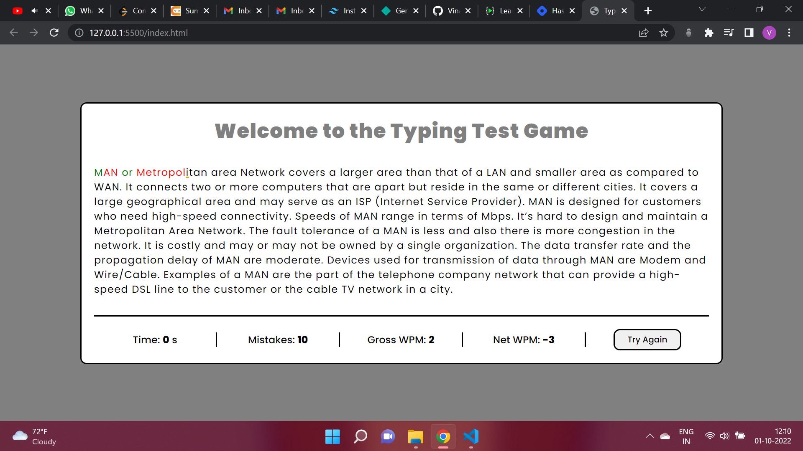

# **Typing Test Game**
## **Overview**
This is a typing test game in which a user can type the given paragraph and can see his mistakes, Net typing Typing Speed and Gross Typing Speed while typing. This game also marks wrong typed word in red color so that you can identify them and correct one in green.

## **Technology Used**
1. HTML
2. CSS
3. JavaScript

## **Output**

## **Live Link**
